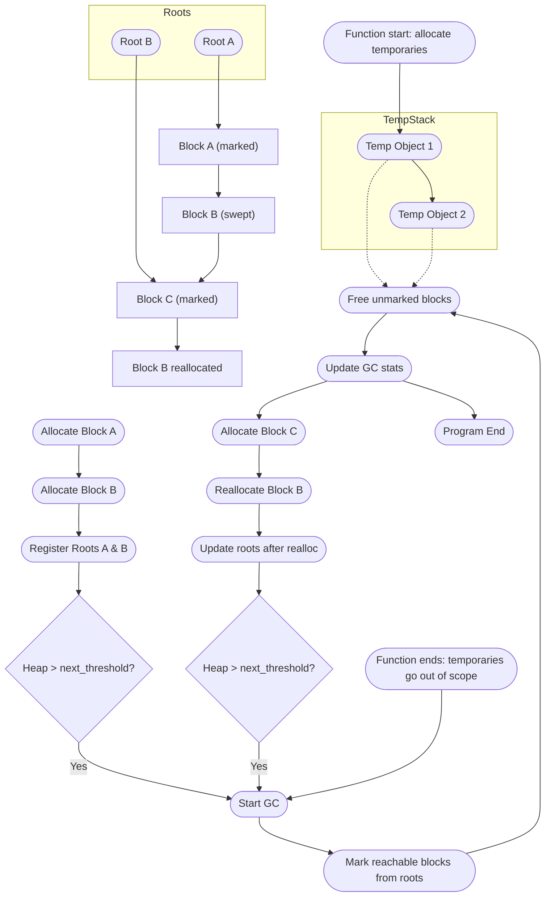

# ft-gc

> [!NOTE]
> Developed with guidance from ChatGPT (OpenAI GPT-5 model). All generated code and explanations were manually reviewed and adapted to fit the 42 C coding style.

A compact, educational **garbage collector** written in C. Implements **mark-and-sweep GC**, manual root registration, and **eager collection of temporary stack objects**. Debug mode outputs detailed logging of allocations, frees, and roots.

> [!TIP]
> Compile with `-DGC_DEBUG` to see debug GC operations.

---

## Design Overview

### Memory Model

* **Blocks (`t_gc_block`)**: Each allocation has metadata including `size`, `atomic` flag, `marked`, payload pointer, root pointer, and next block pointer.
* **Roots (`t_gc_root`)**: Persistent pointers into the heap for marking reachable objects.
* **State (`t_gc_state`)**: Tracks blocks, roots, total payload, last live size, next collection threshold, and an approximate stack base.
* **Stack base**: Recorded at `gc_create()` to detect stack-local pointers and prevent registering them as persistent roots.

---

## Core Principles

1. **Allocation**

   * `gc_malloc` / `gc_malloc_atomic` allocate memory and optionally register a persistent root.
   * Temporary stack-local allocations (inside function scopes) are **not registered as roots** and are collectible once they go out of scope.

2. **Reallocation**

   * `gc_realloc` creates a new block and copies data.
   * If the old block had a root, the root is updated to point to the new block.
   * Old block is freed immediately after reallocation.

3. **Garbage Collection**

   * Triggered manually via `gc_collect()` or automatically if `total_payload > last_live + next_threshold`.
   * **Mark-and-sweep strategy**:

     * **Mark**: Traverse roots and mark reachable blocks.
     * **Sweep**: Free unmarked blocks.
   * Updates `last_live` and calculates `next_threshold` as `max(2*last_live, GC_DEFAULT_THRESHOLD)`.

4. **Root Management**

   * Only non-stack addresses are registered as persistent roots.
   * Stack-local variables are automatically collectible after their function scope exits.
   * Atomic allocations (via `gc_malloc_atomic`) are not interpreted as containing pointers, but roots still track their block if provided.

---

## Master Garbage Collector Lifecycle Diagram



> [!NOTE]  
> **Diagram key:**  
> * Blocks labeled **“marked”** are live blocks reachable via roots.  
> * Blocks labeled **“swept”** are unmarked and freed during sweep.  
> * **Reallocated** blocks show root updates.  
> * **Temporary stack objects** are collected eagerly when the function scope ends.

---

## Running Tests

### `test_small.c` — Minimal demonstration

```sh
gcc -DGC_DEBUG -Wall -Wextra -Wpedantic -Werror -g -fsanitize=address,undefined gc/*.c tests/test_small.c -Igc -o test_small && \
./test_small
```

*Shows allocation, reallocation, automatic GC, and final heap stats.*

---

### `test_eager.c` — Eager collection demonstration

```sh
gcc -DGC_DEBUG -Wall -Wextra -Wpedantic -Werror -g -fsanitize=address,undefined gc/*.c tests/test_eager.c -Igc -o test_eager && \
./test_eager
```

*Confirms temporary stack objects are collected immediately after function scope exits.*

---

### `test_large.c` — Stress test

```sh
gcc -DGC_DEBUG -Wall -Wextra -Wpedantic -Werror -g -fsanitize=address,undefined gc/*.c tests/test_large.c -Igc -o test_large && \
./test_large
```

*Allocates tens of thousands of small blocks, mixes atomic and non-atomic allocations, reallocations, and automatic GC.*

### `test_transitive.c` — Stress test

```sh
gcc -DGC_DEBUG -Wall -Wextra -Wpedantic -Werror -g -fsanitize=address,undefined gc/*.c tests/test_transitive.c -Igc -o test_transitive && \
./test_transitive
```
