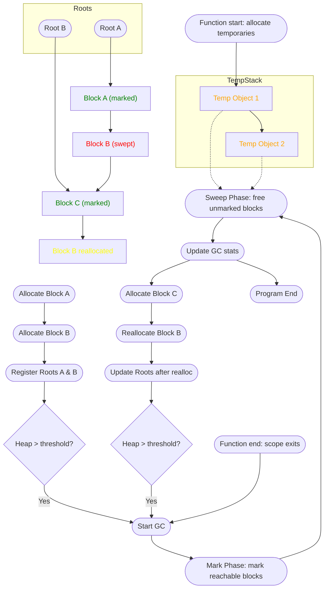
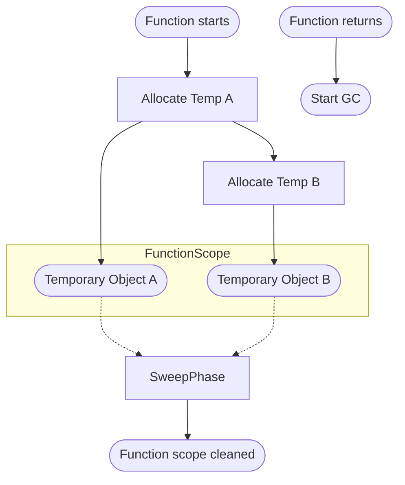
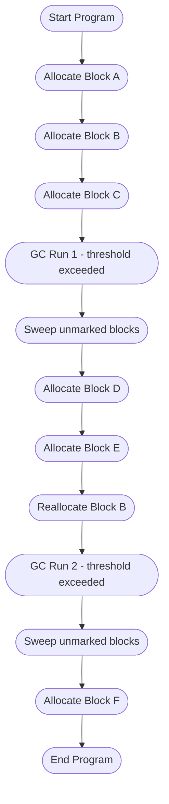

# ft-gc

> [!NOTE]
> This project was developed with heavy assistance from ChatGPT (OpenAI’s GPT-5 model).
> All generated code and explanations were carefully reviewed, tested, and adjusted manually to ensure correctness, style compliance, and alignment with the 42 school’s C coding standards.

---

A compact, educational **garbage collector** implementation written in C, following the **42 school network’s strict C code style**.
It provides automatic memory management with basic mark-and-sweep collection, manual root registration, and optional debug logging.

> [!TIP]
> Pass the `-DGC_DEBUG` flag when compiling to enable colored debug output showing allocations, collections, and root operations.

---

## Design Overview

### Memory Model

* **Blocks (`t_gc_block`)**: Metadata per allocation: `size`, `atomic`, `marked`, payload pointer, link to root, next block.
* **Roots (`t_gc_root`)**: Pointers referencing allocated blocks for marking.
* **State (`t_gc_state`)**: Tracks allocated blocks, roots, heap size, and collection thresholds.
* **Stack base**: Approximate stack address recorded at `gc_create` to avoid registering stack-local pointers as persistent roots.

---

## Combined Master Lifecycle Diagram

> [!TIP]
> Green = live/marked blocks, Red = freed/swept blocks, Yellow = reallocated blocks, Orange = temporary stack-local objects.



> [!NOTE]
>
> * **Green blocks** = live/marked persistent allocations.
> * **Red blocks** = unmarked, freed during sweep.
> * **Yellow blocks** = reallocated blocks with updated roots.
> * **Orange blocks** = temporary stack-local objects, automatically freed when scope ends.
> * This diagram visualizes both the **persistent root-managed heap** and **eagerly collected temporaries**.

---

## Mermaid Diagram: Eager Collection of Temporary Stack Objects

> [!TIP]
> Illustrates temporary stack-local objects being collected once they go out of scope.



> [!NOTE]
>
> * Temporary objects are **not registered as roots**.
> * They are freed automatically during sweep after scope exits.

---

## Mermaid Diagram: Allocation & Collection Timeline

> [!TIP]
> Visualizes multiple allocations, GC runs, and heap growth over time (`test_large.c`).



> [!NOTE]
>
> * Each step shows allocation, reallocation, or GC.
> * Sweeping removes unmarked blocks including temporary stack objects.
> * Demonstrates dynamic threshold-triggered garbage collection.

---

## Running Tests

### `test_small.c`

**Purpose:** Minimal demonstration of allocation, reallocation, and automatic garbage collection.

```sh
gcc -DGC_DEBUG -Wall -Wextra -Wpedantic -Werror -g -fsanitize=address,undefined gc/*.c test_small.c -Igc -o test_small && ./test_small
```

> [!TIP]
> Final stats show remaining live blocks after `gc_collect()`.

---

### `test_eager.c`

**Purpose:** Demonstrates **eager collection** of temporary stack-scoped objects.

```sh
gcc -DGC_DEBUG -Wall -Wextra -Wpedantic -Werror -g -fsanitize=address,undefined gc/*.c test_eager.c -Igc -o test_eager && ./test_eager
```

> [!IMPORTANT]
> Temporary objects created inside a function are freed immediately after the function returns when `gc_collect()` is called.
> Confirms stack-scoped objects are collectible.

---

### `test_large.c`

**Purpose:** Stress test to validate GC behavior under heavy load.

```sh
gcc -DGC_DEBUG -Wall -Wextra -Wpedantic -Werror -g -fsanitize=address,undefined gc/*.c test_large.c -Igc -o test_large && ./test_large
```

> [!WARNING]
> Allocates tens of thousands of small blocks. Monitor memory usage if running on low-RAM environments.

> [!TIP]
> Mix of atomic and non-atomic allocations tests proper root tracking and heap management.
> Final stats display live block count and payload size.

---

## Notes

> [!NOTE]
>
> * Mark-and-sweep GC with explicit root management.
> * Handles both atomic and non-atomic allocations.
> * Temporary stack allocations are automatically collectible.
> * Single-threaded; not suitable for multi-threaded production use.
> * Debug output provides detailed allocation, collection, and root tracking.
